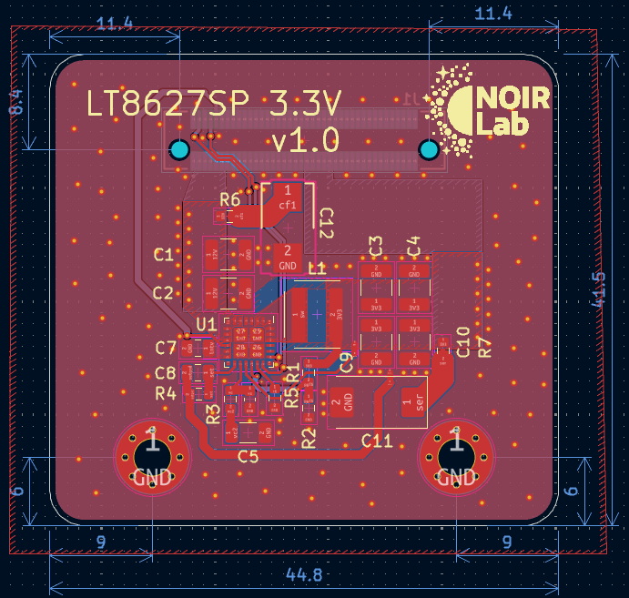
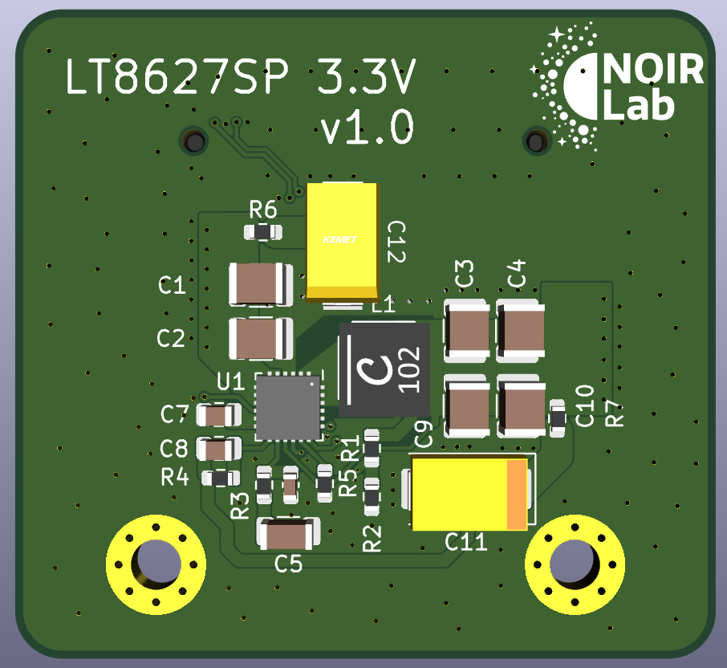

# mdc-power-p3v3
Modular Detector Controller Power 3.3V DC-DC Mezzanine Module

## Overview
12V input to 3.3V output DC-DC module, 8A nominal output, used as one of the `mdc-power-*` bias rails.
Designed for 2 MHz sync operation.
Mezzanine module.

## Power Stage
- Controller: `LT8627SP` (`U1`)
  - Silent Switcher 3 synchronous step-down regulator.
  - Ultralow EMI emissions and high efficiency at high switching frequency.
  - Constant-frequency current-mode control.
  - External sync capability.
- Inductor: `L1` = `1uH`
  - Uses the XGL5030 shielded power inductor family (see `docs/xgl5030.pdf`).
  - Shielded construction to reduce radiated EMI and coupling into sensitive nodes.
  - Very low DCR family to reduce copper loss and improve efficiency.
  - Low AC loss construction optimized for high-frequency switching.

## Files
- Schematic: `power_p3v3.pdf`
- Simulation: `sim/` (LTspice and LTpowerCAD files used for loop and transient checks)

## Board Dimensions
- 44.8 mm x 41.5 mm

## Board Stackup
- 4-layer PCB

## CAD
- Designed using KiCad 9.

## Interface
- Control pins: `EN` (enable) and `PG` / `~PGOOD` (power good).
- Connector: `LSHM-140-04.0-L-DV-A-N-K-TR` (Samtec LSHM series) mezzanine for power and control signals.
  - Common pinout is shared across the 16V, -16V, 6V, and 3.3V variants.
  - Unused output rails are tied to GND on the specific module variant.

## Images
Layout:

3D view:

